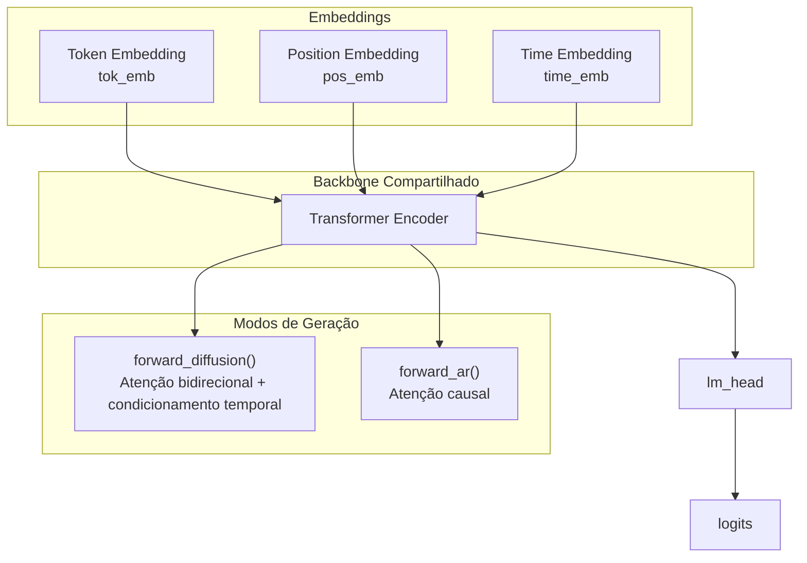

<div align="center">

# 🧠 DiffuGPT

**Geração de texto híbrida com difusão discreta e refinamento autoregressivo**

[](https://python.org)
[](https://pytorch.org)
[](https://flask.palletsprojects.com)
[](https://github.com/perepepeu/DiffuGPT)
[](LICENSE)

> Modelo híbrido de linguagem construído do zero em Python e PyTorch, combinando difusão discreta mascarada com refinamento autoregressivo estilo GPT.

[Repositório oficial](https://github.com/perepepeu/DiffuGPT)

</div>

---

## 📖 Visão Geral

O **DiffuGPT** é um modelo de linguagem híbrido criado para explorar uma abordagem diferente da geração de texto tradicional.

Em vez de depender apenas da geração autoregressiva da esquerda para a direita, o projeto combina:

- **Difusão discreta mascarada** para gerar um rascunho global
- **Refinamento autoregressivo** para corrigir tokens, melhorar coerência e aumentar a fluidez final
- **Um backbone Transformer compartilhado** para operar nos dois modos

O projeto foi desenvolvido do zero em **Python + PyTorch** e inclui um pipeline completo de:

- tokenização;
- preparação de dados;
- treinamento;
- inferência por CLI;
- interface web com Flask.

Isso faz do DiffuGPT um projeto útil tanto para **pesquisa prática** quanto para **portfólio técnico**.

---

## ✨ Destaques

- Construído do zero, sem depender de classes prontas de modelos da Hugging Face
- Arquitetura híbrida: difusão para estrutura global, autoregressivo para refinamento local
- Tokenizer BPE byte-level implementado manualmente
- Backbone Transformer compartilhado entre dois comportamentos
- Pipeline completo no mesmo repositório: dados, tokenizer, treino, inferência e interface web
- Projeto fácil de estudar, modificar e expandir
- Boa base para experimentos com modelos de linguagem por difusão

---

## 🏗️ Arquitetura

O modelo utiliza um **Transformer Encoder compartilhado** que suporta dois modos diferentes de geração:

- **Modo Diffusion**: atenção bidirecional para prever tokens mascarados iterativamente
- **Modo AR**: atenção causal para previsão do próximo token no estilo GPT



| Componente | Detalhes |
|---|---|
| **Backbone** | `TransformerEncoder` compartilhado |
| **Embeddings** | Embeddings de token, posição e timestep |
| **Modo Diffusion** | Reconstrução bidirecional de tokens mascarados |
| **Modo AR** | Predição causal do próximo token |
| **Saída** | `lm_head` compartilhada para projeção dos logits |

---

## 🧠 Por que esse projeto é interessante

O DiffuGPT não é apenas uma cópia reduzida de um GPT tradicional.

Ele explora uma ideia menos comum em geração de texto: combinar **reconstrução global paralela** com **correção local sequencial**.

Isso torna o projeto interessante para:

- pesquisa em modelos híbridos generativos;
- estudo de difusão discreta aplicada a texto;
- experimentos com estratégias de decodificação;
- aprendizado prático sobre tokenização, Transformers e treino de modelos de linguagem;
- construção de um portfólio técnico diferenciado.

---

## 📦 Estrutura do projeto

```text
DiffuGPT/
│
├── config.py                  # Hiperparâmetros globais
├── train.py                   # Loop de treinamento híbrido
├── train_tokenizer.py         # Treina o tokenizer BPE customizado
├── sample.py                  # Geração via linha de comando
├── requirements.txt           # Dependências do projeto
├── README.md
│
├── data/
│   ├── dataset.txt            # Corpus bruto de treino
│   ├── dataset.py             # Dataset PyTorch
│   ├── prepare.py             # Tokeniza o texto e gera blocos .npy
│   ├── tok-1024.model         # Tokenizer treinado
│   └── train_ids.npy          # Dataset tokenizado
│
├── model/
│   ├── hybrid_model.py        # Modelo híbrido (Diffusion + AR)
│   └── scheduler.py           # Scheduler de mascaramento com curva cosseno
│
├── tokenizer/
│   ├── __init__.py
│   └── bpe_tokenizer.py       # Tokenizer BPE byte-level customizado
│
├───web/
│   ├── app.py                # Backend Flask
│   │
│   ├───static
│   ├────── style.css         # Estilo da interface web
│   │
│   ├───templates
│   └────── index.html        # Template HTML da interface               
│
└── checkpoints/               # Checkpoints salvos durante o treino
```

---

## ⚙️ Configuração padrão

Principais parâmetros definidos em `config.py`:

| Parâmetro | Valor | Descrição |
|---|---:|---|
| `vocab_size` | `1024` | Tamanho do vocabulário BPE |
| `block_size` | `128` | Comprimento máximo da sequência |
| `emb_dim` | `256` | Dimensão dos embeddings |
| `n_layers` | `6` | Número de camadas Transformer |
| `n_heads` | `8` | Número de cabeças de atenção |
| `max_timesteps` | `8` | Passos de difusão |
| `batch_size` | `16` | Tamanho do batch |
| `lr` | `2e-4` | Taxa de aprendizado |
| `epochs` | `30` | Número de épocas |
| `ar_alpha` | `0.5` | Peso da loss AR na loss híbrida |
| `ar_refine_mode` | `"balanced"` | Estratégia de refinamento AR |

---

## 🧾 Formato do dataset

O projeto espera um arquivo de texto bruto em:

```text
data/dataset.txt
```

### Requisitos

| Item | Detalhe |
|---|---|
| Formato | `.txt` puro em UTF-8 |
| Tamanho recomendado | Pelo menos ~500 KB |
| Idioma | Qualquer idioma presente no corpus |
| Estrutura | Texto contínuo, sem formatação especial obrigatória |

### Fontes válidas

- livros e contos em `.txt`;
- exportações da Wikipedia;
- diálogos e conversas;
- letras de músicas e poesias;
- textos técnicos;
- corpus próprios de domínio específico.

### Exemplo

```text
Era uma vez um reino muito distante onde todos viviam em paz. O rei era justo e a rainha, sábia. Juntos governavam com bondade. Certo dia, um viajante chegou trazendo notícias do além-mar...
```

O pipeline de pré-processamento faz automaticamente:

1. treinamento do tokenizer BPE no corpus;
2. conversão do texto em IDs de tokens;
3. divisão da sequência em blocos fixos;
4. salvamento do resultado em `train_ids.npy`.

---

## 🏋️ Pipeline de treinamento

```text
dataset.txt
   │
   ├── train_tokenizer.py
   │      └── treina o tokenizer BPE byte-level
   ▼
tok-1024.model
   │
   ├── data/prepare.py
   │      └── tokeniza o corpus e gera blocos fixos
   ▼
train_ids.npy
   │
   ├── train.py
   │      └── treino híbrido: diffusion + autoregressivo
   ▼
model.pt + checkpoints/
```

---

## 🔬 Objetivo híbrido

Cada batch combina dois sinais de aprendizado:

```text
loss = (1 - ar_alpha) * loss_diffusion + ar_alpha * loss_ar
```

Isso permite que o modelo aprenda ao mesmo tempo:

- reconstrução global por difusão;
- previsão local token a token via modo autoregressivo.

---

## 🚀 Instalação

```bash
git clone https://github.com/perepepeu/DiffuGPT.git
cd DiffuGPT
pip install -r requirements.txt
```

### Principais dependências

- torch
- flask
- tqdm
- numpy
- regex

---

## ⚡ Início rápido

### 1) Treinar o tokenizer

```bash
python train_tokenizer.py
```

### 2) Preparar o dataset

```bash
python data/prepare.py
```

### 3) Treinar o modelo

```bash
python train.py
```

Exemplo de saída durante o treino:

```text
Epoch 1/30 | Train 5.67 | Val 5.22 | Diff 5.84 | AR 5.50
```

### 4) Gerar texto via CLI

```bash
python sample.py
```

Modos disponíveis:

```text
1) Diffusion
2) AR puro (GPT-style)
3) Híbrido — balanced
4) Híbrido — fast
```

---

## 🎛️ Modos de geração

| Modo | Descrição |
|---|---|
| `diffusion` | Geração iterativa por tokens mascarados com atenção bidirecional |
| `ar` | Geração autoregressiva pura, estilo GPT |
| `hybrid-balanced` | Rascunho por difusão + correção AR mais forte |
| `hybrid-fast` | Rascunho por difusão + correção AR mais leve |

---

## 🧪 Exemplos de uso pela CLI

### Diffusion

```bash
python sample.py --mode diffusion --prompt "Era uma vez" --steps 24 --show-steps
```

### AR

```bash
python sample.py --mode ar --prompt "No início" --max-new-tokens 80 --temperature 1.0
```

### Híbrido balanced

```bash
python sample.py --mode hybrid-balanced --prompt "O cientista descobriu"
```

### Híbrido fast

```bash
python sample.py --mode hybrid-fast --prompt "O cientista descobriu"
```

---

## 🌐 Interface web

Execute a aplicação Flask:

```bash
cd web
python app.py
```

Depois, abra no navegador:

```text
http://localhost:5000
```

A interface web oferece:

- geração por prompt;
- seleção de modo;
- visualização do texto gerado;
- ambiente prático para experimentação local.

---

## 🔌 Exemplo de API

### `POST /generate`

```json
{
  "prompt": "Era uma vez",
  "mode": "hybrid",
  "min_tokens": 32,
  "temperature": 1.0,
  "threshold": 0.55
}
```

Modos aceitos:

- `"diffusion"`
- `"ar"`
- `"hybrid"`

---

## 📈 Fluxo de inferência

```text
Prompt
  │
  ▼
[MASK][MASK][MASK]...[MASK]
  │
  ▼
Denoising por difusão
  │
  └── gera um rascunho global
  ▼
Refinamento AR
  │
  └── corrige tokens fracos ou incoerentes
  ▼
Texto final
```

---

## ✅ Pontos fortes

O que torna o DiffuGPT um projeto forte:

- não é apenas mais um GPT pequeno, porque testa uma ideia híbrida real;
- explora difusão em texto, uma área menos comum do que geração autoregressiva pura;
- une pesquisa e prática em um único repositório;
- inclui tokenizer, treino, inferência e interface web;
- é modular o bastante para novos experimentos;
- tem valor educacional alto para estudar o funcionamento interno de modelos de linguagem;
- funciona muito bem como projeto de portfólio técnico.

---

## 🎯 Uso pretendido

O DiffuGPT é mais adequado para:

- experimentos com geração híbrida;
- pesquisa em modelos de linguagem por difusão;
- projetos educacionais;
- protótipos locais;
- demonstrações técnicas e portfólio.

Ele **ainda não é** um foundation model pronto para uso comercial em larga escala.

---

## 🛣️ Roadmap

- métricas e benchmarks mais fortes;
- datasets maiores e mais limpos;
- objetivo de difusão mais robusto;
- otimização de inferência;
- suporte a quantização;
- API e fluxo de deploy mais maduros;
- model card e benchmark report.

---

## 🧹 Limpeza

Exemplo de script PowerShell para limpar arquivos gerados:

```powershell
Remove-Item -Force model.pt -ErrorAction SilentlyContinue
Remove-Item -Force logs.json -ErrorAction SilentlyContinue
Remove-Item -Recurse -Force checkpoints\* -ErrorAction SilentlyContinue
Remove-Item -Recurse -Force loss\ -ErrorAction SilentlyContinue
Remove-Item -Force data\train_ids.npy -ErrorAction SilentlyContinue
Remove-Item -Force data\tok-1024.model -ErrorAction SilentlyContinue
Get-ChildItem -Recurse -Directory -Filter "__pycache__" | Remove-Item -Recurse -Force
```

---

## 🤝 Contribuindo

Contribuições são bem-vindas.

1. Faça um fork do repositório
2. Crie uma branch: `git checkout -b feature/minha-feature`
3. Commit suas mudanças: `git commit -m "feat: adiciona minha feature"`
4. Envie para a branch: `git push origin feature/minha-feature`
5. Abra um Pull Request

---

## 📄 Licença

Este projeto está licenciado sob a **MIT License**.

---

<div align="center">

Feito com PyTorch, curiosidade e muitos tokens mascarados.

**DiffuGPT** — onde difusão discreta encontra refinamento estilo GPT.

</div>
